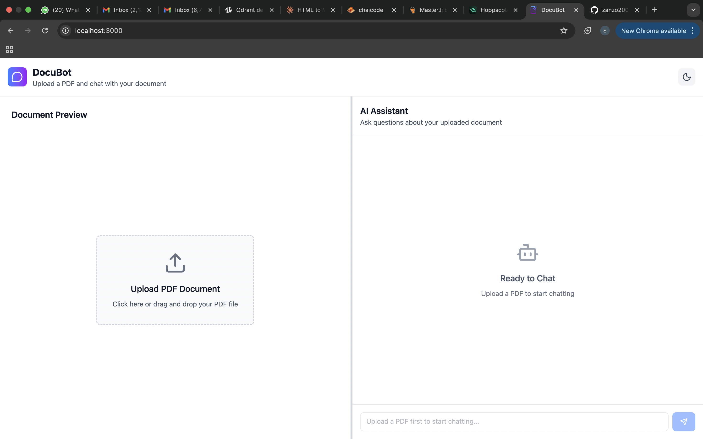
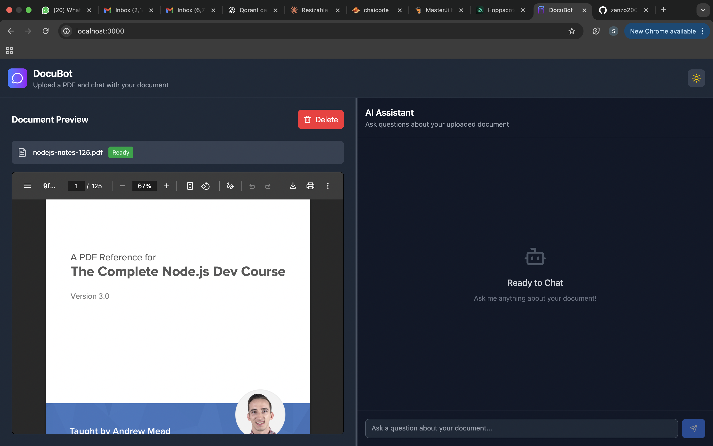
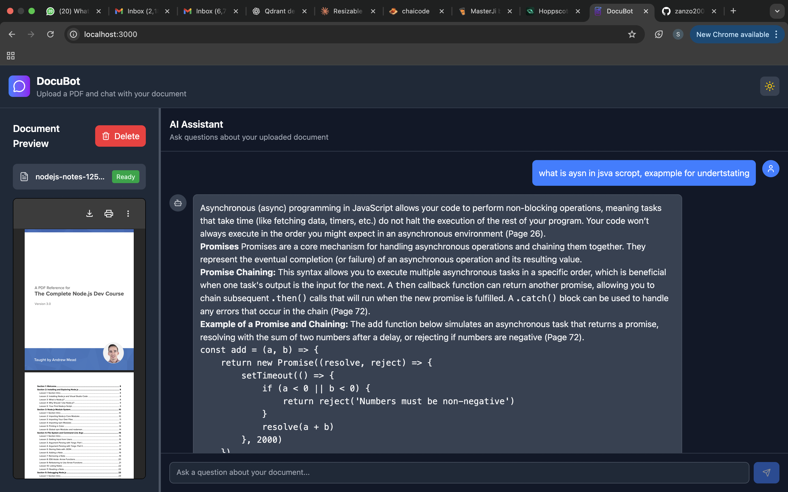

# DocuBot — RAG-based AI Chatbot

Retrieval-Augmented Generation pipeline using **React**, **Node.js**, **LangChain**, **Qdrant**, and **Google Gemini**. Enhances prompts, retrieves semantic chunks, and generates grounded answers.


- Backend repo - https://github.com/zanzo2003/DocuBot_backend 
- Frontend repo - https://github.com/zanzo2003/DocuBot_frontend

## 🚀 Key Features

- **Advanced RAG pipeline**: prompt enhancement → retrieval → grounded generation
- **Prompt Enhancer**: rewrite & normalize queries to improve retrieval recall
- **Semantic retrieval** with Qdrant (top-k chunk search)
- **PDF ingestion**: chunking + embeddings using LangChain loaders
- **Modular backend**: services, controllers, routes, utils, db, middleware for easy extension

## 🔍 How it Works

1. **Ingest**: PDF → chunk → embed → store in Qdrant
2. **Enhance**: user query rewritten (LLM) to increase retrieval quality
3. **Retrieve**: semantic search (top-k) returning relevant chunks
4. **Answer**: LLM generates response grounded on retrieved context

## 🏗️ Tech Stack

**Frontend**: React  
**Backend**: Node.js, Express  
**AI/ML**: LangChain, Google Generative AI (Gemini), GoogleGenerativeAIEmbeddings  
**Vector Database**: Qdrant  

## 📁 Project Structure

```
DocuBot/
├─ frontend/                 
├─ backend/
├─ screenshots/            
└─ README.md
```

## ⚙️ Installation

1. **Clone the repository**
   ```bash
   git clone https://github.com/your-username/DocuBot.git
   cd DocuBot
   ```

2. **Setup Backend**
   ```bash
   cd backend
   npm install
   ```

3. **Environment Configuration**
   
   Create a `.env` file in the backend directory:
   ```env
   PORT=8080
   QDRANT_URL=http://localhost:6333
   QDRANT_COLLECTION=docubot_collection
   GOOGLE_API_KEY=your_google_api_key
   GENAI_BASE_URI=https://generativelanguage.googleapis.com/v1beta/openai
   FRONTEND_URL=http://localhost:3000
   NODE_ENV=development
   ```

4. **Start Backend**
   ```bash
   npm run dev
   ```

5. **Setup Frontend**
   ```bash
   cd ../frontend
   npm install
   npm start
   ```

## 📡 API Usage Examples

### Upload File
```bash
curl -X POST http://localhost:8080/api/files/upload \
  -F "file=@/path/to/file.pdf"
```

### Chat / RAG Query
```bash
curl -X POST http://localhost:8080/api/chat \
  -H "Content-Type: application/json" \
  -d '{
    "query": "Summarize section 2",
    "fileName": "file.pdf"
  }'
```

### Delete Vectors
```bash
curl -X DELETE http://localhost:8080/api/files/file.pdf
```

## 📂 Screenshots & Demo

Add your screenshots to the `./screenshots/` directory:
- 
- 
- 

### 🎥 Demo Video
[YouTube video link](https://youtu.be/ESFQcls1_VU)


## 📌 Roadmap

- [ ] Support DOCX / MD ingestion and automatic OCR
- [ ] Streaming LLM responses + token-level highlights
- [ ] Docker + k8s deployment & infra templates
- [ ] Per-user sessions, multi-tenant support, and auth


**Suggested branches**: 
- `main` (stable)
- `dev` (work-in-progress)


*Built with LangChain • Qdrant • Gemini*
